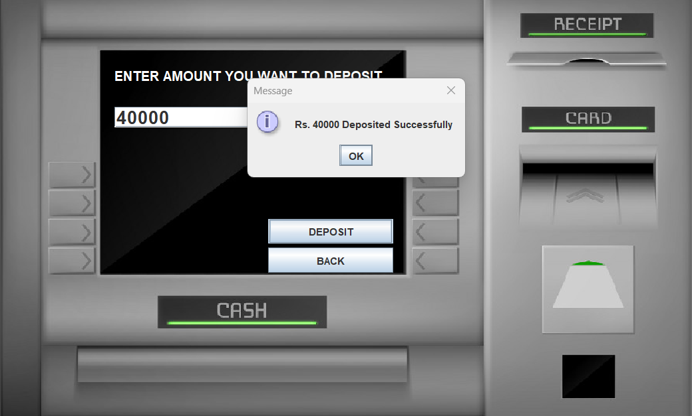

# Bank Management System

## Project Description
The **Bank Management System** is a desktop application built using **Core Java (Swing & AWT)** for the frontend and **MySQL Workbench** as the database. It provides functionalities like user signup, login, transactions, withdrawals, fast cash, PIN management, and mini statements.

## Technologies Used
- **Programming Language:** Java (Swing & AWT)
- **Database:** MySQL Workbench
- **IDE:** NetBeans

## Project Structure
The project contains the following Java files:
- **conn.java** – Handles database connections
- **login.java** – Manages user login functionality
- **signupOne.java** – First step of user registration
- **signupTwo.java** – Second step of user registration
- **signupThree.java** – Third step of user registration
- **Transactions.java** – Handles different transaction types
- **Withdrawl.java** – Manages withdrawal functionality
- **FastCash.java** – Enables quick cash withdrawals
- **pin.java** – Handles PIN changes
- **minstatement.java** – Generates mini statements

---

## Installation & Setup
### 1. Clone the Repository
```sh
 git clone https://github.com/Gyaneshkr5009/Bank_Management_system.git
 cd bank-management-system
```

### 2. Install MySQL Workbench
Download and install **MySQL Workbench** from the official website: [MySQL Workbench](https://www.mysql.com/products/workbench/)

### 3. Database Setup
#### Open MySQL Workbench and run the following commands:

#### **Create the database**
```sql
CREATE DATABASE bankmanagementsystem;
SHOW DATABASES;
USE bankmanagementsystem;
```

#### **Create tables**

##### **signup table**
```sql
CREATE TABLE signup (
    formno VARCHAR(20),
    name VARCHAR(20),
    father_name VARCHAR(20),
    dob VARCHAR(20),
    gender VARCHAR(20),
    email VARCHAR(40),
    marital_status VARCHAR(20),
    address VARCHAR(50),
    city VARCHAR(25),
    pincode VARCHAR(20),
    state VARCHAR(25)
);
SHOW TABLES;
SELECT * FROM signup;
```

##### **signupTwo table**
```sql
CREATE TABLE signupTwo (
    formno VARCHAR(20),
    religion VARCHAR(20),
    category VARCHAR(20),
    income VARCHAR(20),
    education VARCHAR(20),
    occupation VARCHAR(40),
    pan VARCHAR(20),
    aadhar VARCHAR(50),
    seniorcitizen VARCHAR(25),
    existingaccount VARCHAR(20)
);
SELECT * FROM signupTwo;
```

##### **signupThree table**
```sql
CREATE TABLE signupThree (
    formno VARCHAR(20),
    accountType VARCHAR(40),
    cardnumber VARCHAR(25),
    pin VARCHAR(10),
    facility VARCHAR(100)
);
SELECT * FROM signupThree;
```

##### **login table**
```sql
CREATE TABLE login (
    formno VARCHAR(20),
    cardnumber VARCHAR(25),
    pin VARCHAR(10)
);
USE bankmanagementsystem;
SELECT * FROM login;
```

##### **bank transactions table**
```sql
CREATE TABLE bank (
    pin VARCHAR(10),
    date VARCHAR(50),
    type VARCHAR(20),
    amount VARCHAR(20)
);
SELECT * FROM bank;
```

---

## Running the Application
1. Open **NetBeans IDE**
2. Import the project
3. Ensure that MySQL Workbench is running
4. Run the Java application

---

## Database Connection (conn.java)
Below is the code for establishing a database connection:

```java
package bank_management_system;

import java.sql.*;  

public class Conn{
    Connection c;
    Statement s;
    public Conn(){  
        try{  
            Class.forName("com.mysql.cj.jdbc.Driver");  
            c = DriverManager.getConnection("jdbc:mysql:///yourDBName", "root", "Password");    
            s = c.createStatement(); 
        } catch(Exception e){ 
            System.out.println(e);
        }  
    }  
}  
```

---

## Confirmation Screenshots
You can add images in your project directory under `screenshots/` and refer to them in the README:

Example:
```md





```

---

## Features
- **User Registration** (3-step signup process)
- **User Login**
- **Deposit and Withdrawal Transactions**
- **Quick Cash Withdrawal**
- **PIN Management**
- **Mini Statement Generation**

---

## Future Enhancements
- Implement a graphical dashboard
- Add authentication security improvements
- Introduce account statement exports

---

## Author
Your Name Gyanesh Kumar

